# Indigemoji

Indigemoji is a collection of indigenous flags and important symbols intended for usage on customizable chat platforms like Slack and Discord.

This is an a work in progress and will improve with contributions! The current emojiset are only the flags of North American indigenous nations, tribes, and other organizations found on Wikipedia - so lots of info is bound to be missing.

**To keep the repo size down, I've excluded the Source images - but you can pull full-sized images and flags using the URLs in `sources`**

## Installing on Slack
- Get the emoji files by downloading this [zip file](https://github.com/nativesintech/indigemoji/releases/download/1.0.0/1.0.0.zip) or cloning the directory using git.
- Install the browser extension [Neutral Face Emoji Tools](https://github.com/Fauntleroy/neutral-face-emoji-tools) for Chrome or Firefox
- Navigate to `<your-slack-org>.slack.com/customize/emoji`
- Drag all of the files from the `dist` folder of the zip you downloaded to the "Drop Images Here" section on the emoji upload page

The emoji will be referenced via their respective file names. For example, :flag-caddo: is [dist/flag-caddo.png](dist/flag-caddo.png) 

## Sources:
  - https://commons.wikimedia.org/wiki/Flags_of_Native_Americans_in_the_United_States
  - https://commons.wikimedia.org/wiki/Flags_of_Aboriginal_peoples_of_Canada
## Contributing

Instructions for contributing are coming soon, but for now you can [Create an Issue](https://github.com/nativesintech/indigemoji/issues/new) if you'd like to add or request emoji. Eventually this will be relatively self-service.

---

## Showcase

Click to view all available emoji! Warning: This will load a bunch of images!

     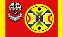      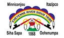  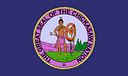       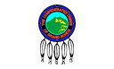          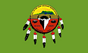        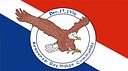         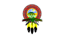     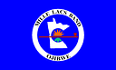   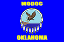      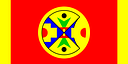        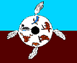        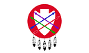         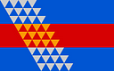                             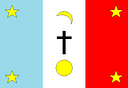 

